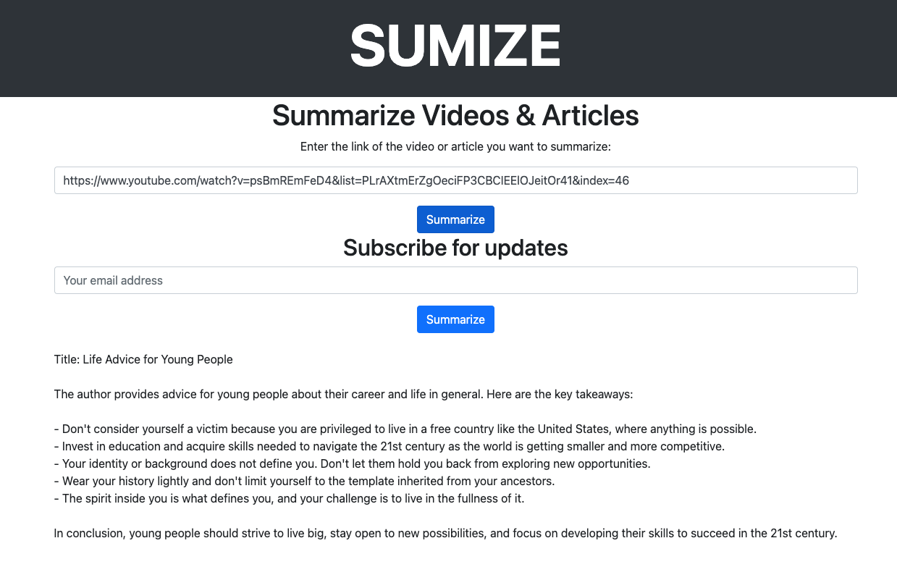

**SUMIZE**: is an AI-powered application that streamlines content consumption by generating concise and coherent summaries of videos and articles from various websites, catering to the diverse needs of people seeking time-saving and efficient information access.





**Execution Steps:**

1. Please clone the GitHub repository and Run your Flask application by executing the following command in the terminal: python app.py

2. Open a web browser and visit http://localhost:5000/ to see your main page.

**AWS deployment steps:**

To run the solution on AWS using Lambda for execution and S3 for hosting the web app, follow these steps:

1. Prepare your application for deployment:

First, create a **requirements.txt** file in your project directory with the necessary dependencies:
<pre>
```
Flask==2.1.1
pytube==12.1.1
openai==0.35.0
```
</pre>


Next, create a zappa_settings.json file in your project directory with the following content:


<pre>
```
{
    "production": {
        "app_function": "app.app",
        "aws_region": "us-east-1",
        "profile_name": "default",
        "project_name": "sumize",
        "runtime": "python3.9",
        "s3_bucket": "your-s3-bucket-name"
    }
}
```
</pre>

Replace **your-s3-bucket-name** with a unique S3 bucket name for your application.

2. Create a virtual environment and install dependencies:

<pre>
```
python -m venv venv
source venv/bin/activate
pip install -r requirements.txt
pip install zappa
```
</pre>

3. Initialize Zappa:

<pre>
```
zappa init
```
</pre>

Follow the prompts and use the default settings.

4. Deploy the application:

Copy code:
<pre>
```
zappa deploy production
```
</pre>

Once the deployment is complete, you'll receive a URL for your deployed application. Save this URL for later use.

5. Create an S3 bucket for static files:

In the AWS Management Console, navigate to the S3 service and create a new bucket with a unique name. Make sure to choose the same region as specified in the **zappa_settings.json** file.

6. Configure the S3 bucket as a static website:

In the S3 bucket settings, navigate to the "Properties" tab and enable "Static website hosting." Set the "Index document" field to "index.html" and save the settings.

7. Upload the static files to the S3 bucket:

Upload the index.html and styles.css files to the S3 bucket. Ensure that the files have public read permissions.

7. Update the Lambda function's environment variables:

In the AWS Management Console, navigate to the Lambda service and find the function that was created by Zappa. Edit the environment variables to include your OpenAI API key:

<pre>
```
OPENAI_API_KEY: your_openai_api_key
```
<pre>

Replace your_openai_api_key with your actual OpenAI API key.

9. Access the web application:

Open the static website URL from your S3 bucket in a web browser. The URL should look like this:

<pre>
```
http://your-s3-bucket-name.s3-website-us-east-1.amazonaws.com
```
</pre>

To create a Lambda function for your application, you'll need to make a few adjustments to your existing Flask application. First, modify your existing app.py to make it compatible with AWS Lambda and API Gateway.

1. Install AWS SDK for Python (Boto3):

<pre>
```
pip install boto3
```
</pre>

2. Update app.py:

Add the following imports at the beginning of the app.py file:

<pre>
```
import json
from botocore.vendored import requests
```
</pre>

Next, wrap the existing code in a new function called lambda_handler:
<pre>
```
def lambda_handler(event, context):
    # The existing code goes here
```
<pre>

At the end of the app.py file, outside the lambda_handler function, remove the following line:

<pre>
```
app.run(debug=True)
```
</pre>

Replace it with the following lines:

<pre>
```
if __name__ == '__main__':
    app.run(debug=True)
```
</pre>

3. Create a new file wsgi.py:

Create a new file named wsgi.py in your project folder with the following content:

<pre>
```
from app import app as application

if __name__ == '__main__':
    application.run()
```
<pre>


4. Update zappa_settings.json:

Update the app_function value in the zappa_settings.json file:
<pre>
```
"app_function": "wsgi.application",
```
</pre>

5. Update the requirements file:

Add boto3 and gunicorn to your requirements.txt:

<pre>
```
Flask==2.1.1
pytube==12.1.1
openai==0.35.0
boto3==1.20.20
gunicorn==20.1.0
```
</pre>


6. Deploy the application with Zappa:

Run the following command to deploy your application:

<pre>
```
zappa deploy production
```
</pre>

Once the deployment is complete, you'll receive a URL for your deployed application. This URL is the API Gateway endpoint for your Lambda function.

Now you have a Lambda function that processes your Flask app. When you send requests to the API Gateway endpoint, it will trigger the Lambda function, which runs your Flask app and returns the summarized content. You'll need to update the front-end code to send requests to this new endpoint.

In your index.html, update the form action to point to the API Gateway URL:

<pre>
```
<form action="https://your-api-gateway-url/production/summarize" method="post">
```
</pre>


Replace https://your-api-gateway-url with the URL provided by Zappa after deployment.


Replace your-s3-bucket-name and us-east-1 with your actual S3 bucket name and region.

Now, your web application is hosted on S3, and the Flask API runs on AWS Lambda. When you submit a video URL through the web app, it will trigger the Lambda function for processing and return the summarized content.
