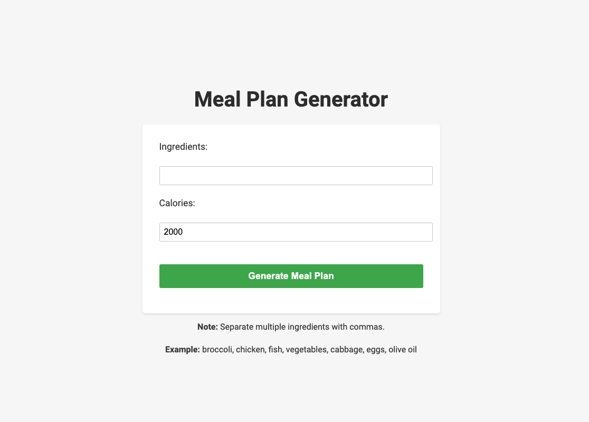

**YUPST**: (your ultimate personalized smart transformer) AI-powered solution for busy individuals and professionals, provides personalized meals, workout and mental plans, 24/7 informational support assistance for a healthy lifestyle and well-being.

**Execution Steps:**

1. Please clone the GitHub repository and Run your Flask application by executing the following command in the terminal: python app.py

2. Open a web browser and visit http://localhost:5008/ to see your main page.

3. Also the application is generating images, please make sure that you have correct file paths